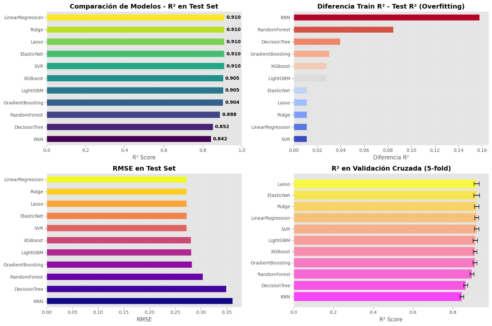

# Predictor de Rendimiento Académico (MOLps) — README

> Herramienta que estima el **GPA final** de estudiantes de primer semestre para identificar tempranamente a quienes necesitan apoyo académico. Esta versión usa la base de datos provista (columnas: 'StudentID, Age, Gender, Ethnicity, ParentalEducation, StudyTimeWeekly, Absences, Tutoring, ParentalSupport, Extracurricular, Sports, Music, Volunteering, GPA, GradeClass'). La app se desplegará con **Streamlit** y los modelos se guardarán/recargarán usando archivos '*.pkl' (pickle).

---
## Contribuidores
- **Franklin David Soncco Machaca**  
- **Milagro Alessandra Rodriguez Camarena**  
- **Jadil Valdez Arone**  
- **Jean Piero Barboza Santa Cruz**  

---

## 1. Objetivo del proyecto
Construir un modelo predictivo que:
- Prediga el **GPA** (variable target: 'GPA') con alta precisión.
- Evite introducir o amplificar sesgos sociales (por ejemplo de género o etnia).
- Provea una interfaz motivacional y accionable para estudiantes y coordinadores.
- Sea reproducible y desplegable con Streamlit.

---

## 2. Consideraciones sobre variables (qué excluir y por qué)

### 2.1 Variables **no informativas** / eliminar
- 'StudentID' — identificador único; **no aporta información predictiva** y su uso puede violar privacidad. **Se ha Eliminado**.

### 2.2 Variables potencialmente **sesgadoras / sensibles** (**no se han usado como features de entrada**)
Estas variables pueden introducir discriminación histórica o amplificar desigualdades.
- 'Gender' — puede llevar a decisiones sesgadas por género.
- 'Ethnicity' — alto riesgo de discriminación étnica.
- 'ParentalEducation' — proxy de estatus socioeconómico; puede reforzar desigualdades.
- 'ParentalSupport' — puede reflejar recursos familiares (sesgo socioeconómico).

**Estrategias alternativas**:
- **Eliminar** estas features del modelo final si el objetivo es evitar sesgo.
- Si por análisis las necesitas (p. ej. para aumentar precisión y luego mitigar sesgo), **mantenerlas fuera del modelo usado en decisiones automáticas** o usarlas solo para análisis post-hoc / explicaciones agregadas.
- Si decides modelarlas, aplicar **métodos de equidad**: re-ponderación, constraints de fairness, o post-processing (p. ej. equalized odds), y reportar métricas de equidad.

### 2.3 Variables recomendadas para mantener (informativas)
- 'Age' — puede correlacionar con madurez/experiencia.
- 'StudyTimeWeekly' — directamente relacionado con rendimiento.
- 'Absences' — impacto negativo esperado en GPA.
- 'Tutoring' — indica intervención educativa.
- 'Extracurricular', 'Sports', 'Music', 'Volunteering' — actividades que pueden correlacionar positiva o negativamente con rendimiento.

### 2.4 Variable especial
- 'GradeClass' — puede ser una versión categórica/agrupada del GPA (p. ej. clases 0..4). **No se usa como feature si por se derivada del GPA** (riesgo de fuga de información). Este clasificacion se puede usar en la salida del modelo de machine learning.

---

## 3. Modelo
### 3.1 Algoritmos implementados
- LinearRegression
- Ridge
- Lasso
- ElasticNet
- SVR
- XGBoost
- LightGBM
- GradientBoosting
- RandomForest
- DecisionTree
- KNN

### 3.2 Procesamiento
- Eliminación de variables sesgadas
- Optimización de hiperparámetros para cada algoritmo de entrenamiento
- Selección del algoritmo con la mejor optimización
### 3.3 Métricas de Evaluación
- RMSE (Root Mean Square Error)
- MAE (Mean Absolute Error)
- R² (Coefficient of Determination)


---
## 4. Resultados

### 4.1 Cuadro comparativo
| Modelo           | Train R² | Test R² | Test RMSE | Test MAE | CV Mean R² | CV Std R² | Overfitting |
|------------------|----------|---------|-----------|----------|------------|-----------|-------------|
| LinearRegression | 0.9217    | 0.9104  | 0.2722    | 0.2184   | 0.9201     | 0.0097    | 0.0113      |
| Ridge            | 0.9217    | 0.9104  | 0.2722    | 0.2185   | 0.9201     | 0.0097    | 0.0113      |
| Lasso            | 0.9217    | 0.9104  | 0.2722    | 0.2185   | 0.9202     | 0.0096    | 0.0113      |
| ElasticNet       | 0.9217    | 0.9104  | 0.2723    | 0.2185   | 0.9202     | 0.0096    | 0.0113      |
| SVR              | 0.9215    | 0.9103  | 0.2724    | 0.2183   | 0.9199     | 0.0094    | 0.0112      |
| XGBoost          | 0.9331    | 0.9050  | 0.2803    | 0.2229   | 0.9127     | 0.0114    | 0.0281      |
| LightGBM         | 0.9321    | 0.9045  | 0.2810    | 0.2240   | 0.9133     | 0.0113    | 0.0276      |
| GradientBoosting | 0.9338    | 0.9037  | 0.2823    | 0.2254   | 0.9118     | 0.0104    | 0.0302      |
| RandomForest     | 0.9733    | 0.8884  | 0.3038    | 0.2399   | 0.8966     | 0.0110    | 0.0848      |
| DecisionTree     | 0.8920    | 0.8523  | 0.3495    | 0.2817   | 0.8658     | 0.0147    | 0.0396      |
| KNN              | 1.0000    | 0.8421  | 0.3614    | 0.2855   | 0.8450     | 0.0125    | 0.1579      |



### 4.2 Modelo elegido (LinearRegression)


---
## 5. Funcionamiento del MLOps
Este proyecto ofrece una interfaz interactiva motivacional dirigida a estudiantes universitarios de primer semestre y coordinadores académicos. La interfaz tiene tres partes principales:

### 5.1 Inicio / Selección de rol
Al abrir la aplicación, el usuario ve una pantalla de inicio donde debe elegir su rol:

- Estudiante

- Coordinador Académico

### 5.2 Si eres Estudiante  

El estudiante ingresa sus datos personales y de estudio:  

`StudentID, Age, Gender, Ethnicity, ParentalEducation, StudyTimeWeekly, Absences, Tutoring, ParentalSupport, Extracurricular, Sports, Music, Volunteering.`  

Ejemplos de posibles entradas para establecer límites razonables:  

```bash
1001, 17, 1, 0, 2, 19.83, 7, 1, 2, 0, 0, 1, 0, 2.93, 2.0
1002, 18, 0, 0, 1, 15.41, 0, 0, 1, 0, 0, 0, 0, 3.04, 1.0
```

De esos datos se tomarán solo algunas características (orden fijo):  
```bash
X = ['Age', 'StudyTimeWeekly', 'Absences', 'Tutoring', 'Extracurricular', 'Sports', 'Music', 'Volunteering']
```

Estas serán las que se pasen al **modelo lineal** cuyos pesos están guardados en el archivo `WeightBestModel.pkl`.  

Se obtiene como salida el **GPA estimado**.  
Además, se le mostrará un **mensaje motivacional personalizado** para fomentar la mejora.  

Ejemplos de mensajes:  

> “Recuerda que cada pequeño esfuerzo cuenta: ¡los grandes resultados vienen de pasos constantes!”  

> “Como dijo Marie Curie: ‘Nada en la vida debe ser temido, sólo comprendido.’ Aprende más, teme menos.”  

> “Tu dedicación de hoy construye tu éxito de mañana — ¡sé constante!”  


### 5.3 Si eres Coordinador Académico  

Tienes dos opciones dentro de la interfaz:  

#### Opción A: Evaluar un estudiante específico  
- Ingresas los datos del estudiante (el mismo vector X que los estudiantes usan).  
- El sistema devuelve el GPA estimado.  
- Además, informa si el estudiante está en riesgo académico o no, y sugiere cómo puede apoyarlo (por ejemplo, aumento de horas de estudio, tutorías, acompañamiento emocional, actividades extracurriculares, etc.).  

#### Opción B: Evaluar grupalmente  
- Usas los datos que han ingresado los estudiantes previamente.  
- El sistema genera una lista de estudiantes en riesgo.  
- Sugerencias de intervención para cada uno según su nivel de riesgo.  


### 5.4 Niveles de Riesgo Académico  

| Nivel       | Indicador (GPA típico) | Situación                                               |
|-------------|------------------------|---------------------------------------------------------|
| 🔴 Alto Riesgo  | < 2.0                  | Riesgo académico grave, posible fracaso                 |
| 🟡 Riesgo Moderado | 2.0 – 2.9              | Rendimiento bajo, necesita apoyo                       |
| 🟢 Bajo Riesgo   | 3.0 – 3.6              | Rendimiento satisfactorio                              |
| ✅ Excelente     | 3.7 – 4.0              | Rendimiento sobresaliente, sin riesgo                  |


### 5.5 Logging y Monitoreo

La aplicación implementa un sistema de registro (logging) para garantizar transparencia, calidad y la posibilidad de mejorar continuamente el modelo y la interfaz.

- **Archivos de registro:**
  - Todos los eventos se guardan en `logs/app.log`.
  - Se crea automáticamente la carpeta `logs` si no existe.
  - El `logging` está configurado en nivel `INFO` y muestra también en consola (StreamHandler).

- **Eventos registrados:**
  - Inicio de la aplicación (`Aplicación iniciada`).
  - Carga exitosa del modelo (`Modelo cargado exitosamente`) o error al cargarlo.
  - Cada predicción realizada por un estudiante con su GPA estimado y los datos de entrada:
    ```
    Predicción estudiante - GPA: X.XX, Datos: {...}
    ```
  - Cada análisis realizado por un coordinador (modo individual) con GPA estimado e ID de estudiante:
    ```
    Predicción coordinador - Estudiante: ID, GPA: X.XX
    ```
  - Registro simulado de guardado de datos de estudiantes o coordinadores.

- **Monitoreo de uso en tiempo real (Sidebar):**
  - Cuenta cuántas predicciones han hecho los estudiantes (`Predicciones estudiantiles`).
  - Cuenta cuántas acciones han hecho los coordinadores (`Acciones de coordinadores`).

- **Listas automáticas de riesgo:**
  - El módulo `coordinator_risk_list()` lee el archivo `logs/app.log` y extrae los estudiantes con GPA < 3.0 para mostrarlos en una lista ordenada por riesgo.
  - Muestra un máximo de 10 estudiantes en riesgo con recomendaciones básicas.

- **Detección de anomalías:**
  - Se pueden extender validaciones para detectar entradas fuera de rango (por ejemplo, ausencias muy altas o horas de estudio inusuales).
  - Si ocurre un error en predicción o en lectura de registros, se registra con `logger.error()` y se muestra un `st.error()` en pantalla.

- **Posible extensión:**
  - Comparar GPA estimado con GPA real cuando esté disponible.
  - Monitorear distribución de errores (RMSE, MAE) en producción.
  - Detectar drift de datos en las variables de entrada X con respecto a los datos de entrenamiento.

---

## 6. Conclusiones


- **Modelo simple y transparente:**  
  La elección de un modelo de regresión lineal permitió mantener la interpretabilidad de las predicciones. Esto es clave en un contexto académico, ya que estudiantes y coordinadores pueden entender fácilmente qué variables influyen en el GPA estimado.

- **Predicción temprana del riesgo académico:**  
  La herramienta predice de manera oportuna el GPA final de estudiantes de primer semestre, permitiendo identificar con antelación a quienes podrían necesitar apoyo académico y optimizando la asignación de recursos de intervención.

- **Interfaz motivacional y personalizada:**  
  El diseño de la interfaz evita mensajes desalentadores. En su lugar, entrega mensajes motivacionales y sugerencias prácticas para que cada estudiante pueda mejorar su rendimiento, alineándose con principios de bienestar y acompañamiento.

- **Ética y reducción de sesgos:**  
  Se excluyeron variables sensibles como género, etnicidad y nivel socioeconómico del modelo predictivo para evitar sesgos en las predicciones. Esto refuerza la equidad y transparencia del sistema.

- **Doble vista (Estudiante y Coordinador):**  
  La interfaz ofrece una experiencia adaptada a cada rol.  
  - Estudiantes: reciben su GPA estimado, mensajes motivacionales y recomendaciones personalizadas.  
  - Coordinadores: obtienen reportes de riesgo académico y sugerencias de intervención para grupos o estudiantes específicos.

- **Monitoreo y mejora continua:**  
  Se implementó un sistema de logging y monitoreo que registra las predicciones, detecta anomalías y permitirá, a futuro, evaluar el desempeño real del modelo (RMSE, MAE, drift de datos). Esto garantiza que la herramienta pueda evolucionar y mantenerse confiable en producción.

- **Impacto esperado:**  
  Al combinar predicciones transparentes, mensajes positivos y recomendaciones concretas, la herramienta no solo identifica el riesgo académico, sino que también fomenta la motivación y la autogestión del aprendizaje en los estudiantes.


